# **ỨNG DỤNG QUẢN LÝ SINH VIÊN**

## Tác giả:
- [scrymastic](https://github.com/scrymastic)
- [DuyVuong](https://github.com/DuyVuong)
- [TrVLong](https://github.com/TrVLong)


## MỤC LỤC

[I. KHẢO SÁT, MÔ TẢ YÊU CẦU BÀI TOÁN](#i-khảo-sát-mô-tả-yêu-cầu-bài-toán)
- [1. MÔ TẢ YÊU CẦU](#1-mô-tả-yêu-cầu)
- [2. PHÂN LOẠI NGƯỜI DÙNG](#2-phân-loại-người-dùng)

[II. PHÂN TÍCH THIẾT KẾ](#ii-phân-tích-thiết-kế)
- [1. TỔNG QUAN](#1-tổng-quan)
- [2. THIẾT KẾ CƠ SỞ DỮ LIỆU](#2-thiết-kế-cơ-sở-dữ-liệu)
- [3. CẤU TRÚC DỰ ÁN](#3-cấu-trúc-dự-án)
- [4. LUỒNG HOẠT ĐỘNG](#4-luồng-hoạt-động)
- [5. PHÂN RÃ CHỨC NĂNG](#5-phân-rã-chức-năng)

[III. DEMO SẢN PHẨM](#iii-demo-sản-phẩm)
- [1. FORM ĐĂNG NHẬP](#1-form-đăng-nhập)
- [2. MÀN HÌNH CHÍNH](#2-màn-hình-chính)
    - [a. Trang chủ](#a-trang-chủ-homepagepanel)
    - [b. Danh mục khoa](#b-danh-mục-khoa-majormanagepanel)
    - [c. Quản lý sinh viên](#c-quản-lý-sinh-viên-studentmanagepanel)
    - [d. Quản lý điểm](#d-quản-lý-điểm-scoremanagepanel)
    - [e. Quản lý môn](#e-quản-lý-môn-subjectmanagepanel)
    - [f. Danh mục lớp](#f-danh-mục-lớp-classmanagepanel)

## NỘI DUNG
### I. KHẢO SÁT, MÔ TẢ YÊU CẦU BÀI TOÁN
#### 1. MÔ TẢ YÊU CẦU
- Hỗ trợ quản lý khoa, lớp, sinh viên, môn học, điểm học phần
- Cung cấp các chức năng cơ bản: xem thông tin, thêm, sửa, xoá các đối tượng
- Kết nối cơ sở dữ liệu để lưu trữ dữ liệu và thực hiện các thao tác
- Đăng nhập qua tên người dùng và mật khẩu

### 2. PHÂN LOẠI NGƯỜI DÙNG
- Admin: Có quyền xem, thêm, sửa, xóa mọi đối tượng
- Guest: Chỉ có quyền xem, không thể thêm, sửa, xóa


## II. PHÂN TÍCH THIẾT KẾ

### 1. TỔNG QUAN

Triển khai **Maven** project

Lợi thế:
- Gợi ý sẵn cấu trúc tổng thể, dễ dàng module hóa dự án, thuận lợi cho phân công công việc, quản lý dự án
- Dễ dàng mở rộng thêm chức năng
- Tự động tải, thêm, bớt thư viện bằng cách thêm, xóa depedency ở file pom.xml
- Cộng đồng lớn, dễ dàng tìm kiếm hỗ trợ

### 2. THIẾT KẾ CƠ SỞ DỮ LIỆU

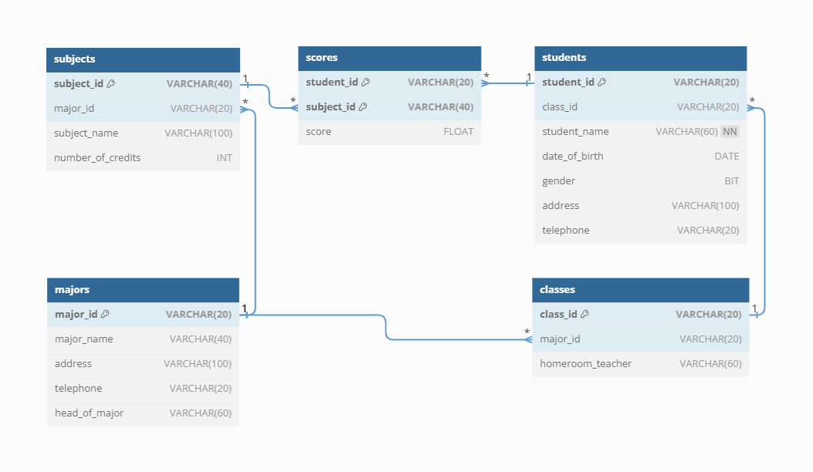

### 3. CẤU TRÚC DỰ ÁN
```
StudentManagementSystem
├── pom.xml
└── src
    └── main
        ├── java/com/kma/sms
        |               ├── StudentManagementSystem.java
        │               ├── authen
        │               │   ├── UserSession.java
        │               │   └── UserSessionRequest.java
        │               ├── ui
        │               │   ├── LoginForm.form
        │               │   ├── MainForm.form
        │               │   ├── studentpopup
        │               │   │   ├── StudentAdder.form
        │               │   │   └── StudentEditor.form
        │               │   ├── ...
        │               ├── controller
        │               │   ├── LoginFormController.java
        │               │   ├── MajorManagePanelController.java
        │               │   ├── ScoreManagePanelController.java
        │               │   ├── ...
        │               ├── model
        │               │   ├── Class.java
        │               │   ├── ClassRequestObject.java
        │               │   ├── ...
        │               ├── dao
        │               │   ├── ClassDAO.java
        │               │   ├── MajorDAO.java
        │               │   ├── ScoreDAO.java
        │               │   ├── ...
        │               └── util
        │                   └── DatabaseConnection.java
        └── resources
            ├── AccountsDatabase.sql
            ├── DatabaseInit.sql
            ├── database.properties
            ├── background.properties
            └── images
                ├── logo.png
                └── header.png
```

***pom.xml:*** Project Object Model, bao gồm:
- Tên project, version, mô tả project
- Danh sách các thư viện, frameworks cần dùng. Maven sẽ tự động tải, include các thư viện này vào project
- Thông tin về build config
- Các thông tin khác

***src/resources:***
- Câu lệnh tạo cơ sở dữ liệu, tài khoản người dùng (`.sql`)
- File cấu hình, thông tin về một số đối tượng (`.properties`)
- Images: folder chứa các file ảnh được dùng trong dự án

***src/main/java/com/kma/sms:***
- `StudentManagementSystem.java`: Entry point của dự án
- `Authen`:
    - `UserSessionRequest`: lưu trữ, truyền đạt thông tin đăng nhập của người dùng đến lớp xử lý
    - `UserSession`: lưu trữ, trả về phiên đăng nhập của người dùng (hợp lệ hay không, kèm quyền của người dùng đó)
- `Model`:
    - Đóng vai trò như cấu trúc dữ liệu, lưu trữ các trường thông tin về đối tượng (`Student`, `Class`, `Score`, …), truyền trong các lớp.
    - `RequestObject`: cấu trúc lưu trữ thông tin cung cấp bởi người dùng, sẽ được gửi đến các lớp xử lý
    - `Non-RequestObject` (`RespondObject`): Cấu trúc lưu trũ thông tin trả về từ chương trình, sau khi xử lý `RequestObject`
- `Ui`:
    - Giao diện người dùng, gồm các `jForm`, `jPanel`
    - Nhiệm vụ tương tác với người dùng, nhận thông tin nhập vào bởi người dùng, gửi đến `controller`
    - Nhận thông tin từ `controller` trả về người dùng
- `Controller`:
    - Lớp trung gian giữa giao diện vào các lớp xử lý thông tin bên dưới (`dao`)
    - Nhiệm vụ kiểm tra thông tin gửi đến từ ui xem có hợp lệ, đúng cú pháp, thay đổi định dạng, format thông tin, construct `RequestObject` gửi đến dao
    - Nhận thông tin trả về từ dao, format lại gửi lên ui
- `Dao`:
    - Data Access Object: cung cấp các phương thức làm việc với cơ sở dữ liệu (thêm, sửa, xóa, …)
    - Nhận request từ `controller`, kết nối từ util
    - Trả về kết quả (là một `RespondObject`) đến controller
- `Util`:
    - `Utility`: nhiệm vụ tạo lập kết nối đến csdl

### 4.LUỒNG HOẠT ĐỘNG

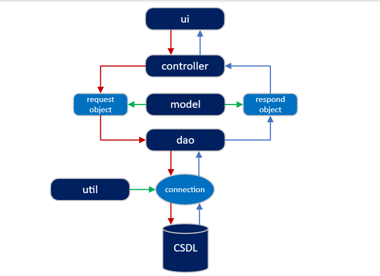

### 5.PHÂN RÃ CHỨC NĂNG

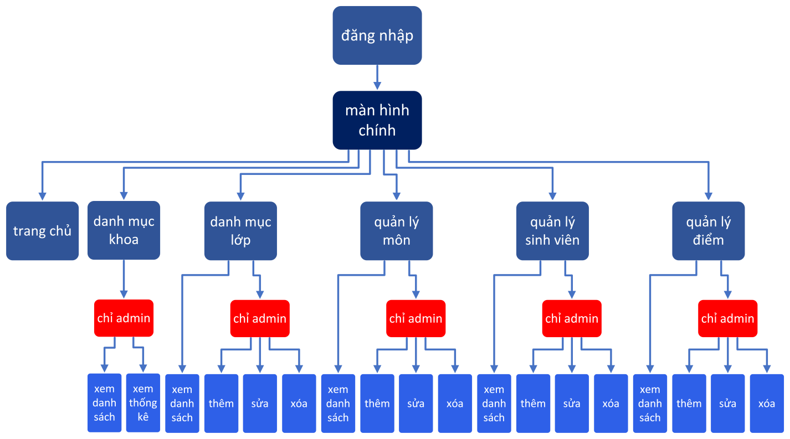

## III.DEMO SẢN PHẨM

### 1.FORM ĐĂNG NHẬP (LoginForm)

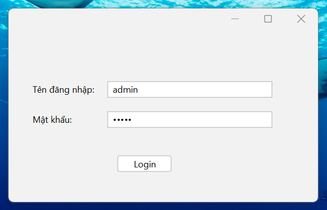

Gồm:
```java
    private javax.swing.JPasswordField PasswordInputField;
    private javax.swing.JButton loginButton;
    private javax.swing.JLabel passwordPanel;
    private javax.swing.JTextField userNameInputField;
    private javax.swing.JLabel userNamePanel;

```

Khi nhấn Login, gọi `LoginFormController` lấy kết quả đăng nhập:

```java
        // Get username and password
        String username = userNameInputField.getText();
        String password = new String(PasswordInputField.getPassword());
        String message = LoginFormController.getLoginMessage(username, password);
	getLoginMessage kiểm tra sơ bộ, các trường phải được điền:
    public static String getLoginMessage(String username, String password) {
        // Check if username and password is empty
        if (username.isEmpty() || password.isEmpty()) {
            // Return error message
            return "Vui lòng nhập tên đăng nhập và mật khẩu";
        }
        int result = sendLoginRequestAndReceiveResponse(username, password);
        String message = "";
        switch (result) {
            case 1:
                message = "Đăng nhập thành công";
                break;
            default:
                message = "Đăng nhập thất bại";
                break;
        }
        return message;
    }
```
`sendLoginRequestAndReceiveResponse` thực hiên hash mật khẩu theo thuật toán **SHA-256**.

Tạo Object `UserSessionRequest` gửi đến `UserDAO` để tạo phiên đăng nhập
```java
    private static int sendLoginRequestAndReceiveResponse(String username, String password) {
        // hash password using SHA-256
        String hashedPassword = "";
        try {
            MessageDigest md = MessageDigest.getInstance("SHA-256");
            byte[] hash = md.digest(password.getBytes(StandardCharsets.UTF_8));
            hashedPassword = String.format("%064x", new BigInteger(1, hash));
        } catch (NoSuchAlgorithmException e) {
            e.printStackTrace();
        }

        UserSessionRequest userSessionRequest = new UserSessionRequest(username, hashedPassword);
        int result = UserDAO.login(userSessionRequest);
        return result;
    }
```
`UserSessionRequest`:
```java
public class UserSessionRequest {
    String username;
    String hashedPassword;

    public UserSessionRequest(String username, String hashedPassword) {
        this.username = username;
        this.hashedPassword = hashedPassword;
    }

    // gettter
    public String getUsername() {
        return username;
    }

    public String getHashedPassword() {
        return hashedPassword;
    }
}
```

`UserDAO`:
```java
public class UserDAO {

    public static int login(UserSessionRequest userSessionRequest) {
        try (Connection connection = DatabaseConnection.connect()){
            // SQL injection prevention
            String query = "SELECT * FROM accounts WHERE username = ? AND hashed_password = ?";
            PreparedStatement preparedStatement = connection.prepareStatement(query);
            preparedStatement.setString(1, userSessionRequest.getUsername());
            preparedStatement.setString(2, userSessionRequest.getHashedPassword());

            System.out.println(preparedStatement);

            java.sql.ResultSet resultSet = preparedStatement.executeQuery();
            if (resultSet.next()) {
                Boolean isAdmin = resultSet.getBoolean("is_admin");
                // create user session
                UserSession.setIsAdmin(isAdmin);
                return 1;
            }
            else {
                return 0;
            }
        }
        catch(SQLException e){
            e.printStackTrace();
        }
        return 0;
    }
}
```
Sau khi nhận kết nối từ `util.DatabaseConnection`, thực hiện tạo câu lệnh query kiểm tra thông tin, kiểm tra quyền (`is_admin`).

Nếu `username` và `hashed_password` đúng, tạo `UserSession`, trả về 1, sau đó người dùng có thể vào màn hình chính.

Nếu không đúng, hiện lỗi:

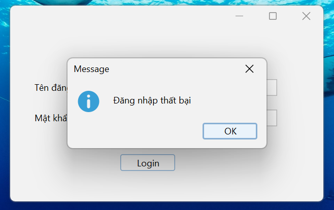

`Util`:
```java
public class DatabaseConnection {

    private static final String PROPERTIES_FILE = "database.properties";
    private static String url;
    private static String user;
    private static String password;
    // Static block to initialize the database properties
    static {
        try (InputStream input = DatabaseConnection.class.getClassLoader().getResourceAsStream(PROPERTIES_FILE)) {
            Properties prop = new Properties();
            if (input == null) {
                throw new IOException("Unable to find " + PROPERTIES_FILE);
            }
            prop.load(input);
            url = prop.getProperty("db.url");
            user = prop.getProperty("db.user");
            password = prop.getProperty("db.password");

        } catch (IOException e) {
            e.printStackTrace();
            throw new RuntimeException("Failed to load database properties", e);
        }
    }

    public static Connection connect() throws SQLException {
        return DriverManager.getConnection(url, user, password);
    }
}

```
Các chức năng sau này đều hoạt động với nguyên lý cơ bản tương tự như `Login`.

## 2.MÀN HÌNH CHÍNH (mainForm)

### a. Trang chủ (homePagePanel)

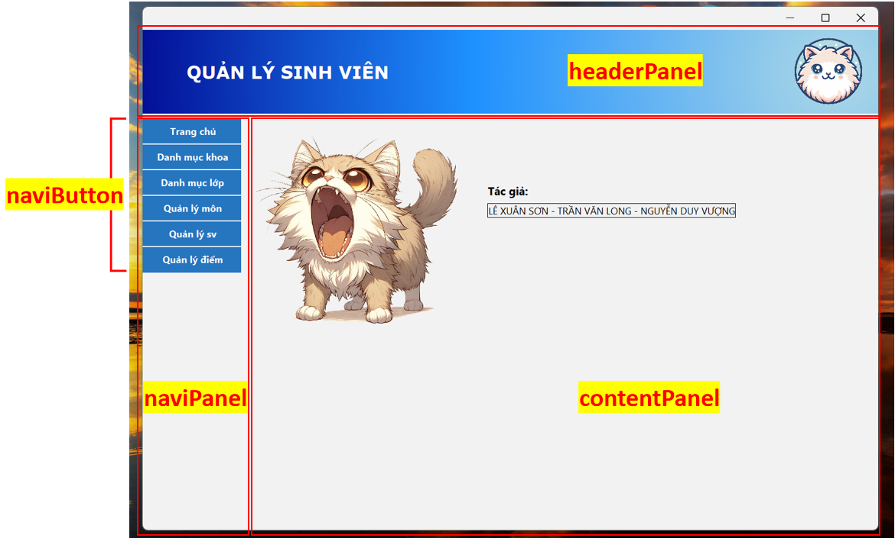

Màn hình chính chia làm 3 khu vực:
```java
    private javax.swing.JPanel contentPanel;
    private javax.swing.JPanel headerPanel;
    private javax.swing.JPanel naviPanel;
```
- `headerPanel`: Hiển thị banner, logo
- `naviPanel`: chứa các nút điều hướng
```java
    private javax.swing.JButton classDirNaviButton;
    private javax.swing.JButton departmentDirNaviButton;
    private javax.swing.JButton homePageNaviButton;
    private javax.swing.JButton scoreMangeNaviButton;
    private javax.swing.JButton studentManageNaviButton;
    private javax.swing.JButton subjectManageNaviButton;
```
- `contentPanel`: show các `jPanel` tương ứng khi người dùng nhấn nút điều hướng, sử dụng `CardLayout`
```java
public class MainForm extends javax.swing.JFrame {

    /* Card layout */
    private void initCardLayout() {
        CardLayout cardLayout = new CardLayout();
        contentPanel.setLayout(cardLayout);
        contentPanel.add(new HomePagePanel(), "homePagePanel");
        contentPanel.add(new MajorManagePanel(), "majorManagePanel");
        contentPanel.add(new ClassManagePanel(), "classManagePanel");
        contentPanel.add(new SubjectManagePanel(), "subjectManagePanel");
        contentPanel.add(new StudentManagePanel(), "studentManagePanel");
        contentPanel.add(new ScoreManagePanel(), "scoreManagePanel");

      // always fit the content panel to the parent panel
        this.pack();
        contentPanel.revalidate();
}

/** Creates new form MainForm */
    public MainForm() {
        initComponents();
        initCardLayout();

}
// ........................................................ //
}
```
Chuyển đổi giữa các `jPanel` trong `CardLayout`
```java
    private void studentManageNaviButtonActionPerformed(java.awt.event.ActionEvent evt) {// GEN-FIRST:event_studentManageNaviButtonActionPerformed
        // show student manage panel and hide other panels
        CardLayout cardLayout = (CardLayout) contentPanel.getLayout();
        cardLayout.show(contentPanel, "studentManagePanel");
    }// GEN-LAST:event_studentManageNaviButtonActionPerformed
```
### b. Danh mục khoa (majorManagePanel)

Chỉ admin có quyền xem ***Danh mục khoa*** và các thống kê liên quan. Kiểm tra quyền của người dùng hiện tại (xảy ra tại `Controller`)
```java
        if (!UserSession.getIsAdmin()) {
            return null;
        }
```
`majorManagePanel` gồm `JTable`, các `jTextField`,…
```java
    private javax.swing.JTextField avgScoreField;
    private javax.swing.JTextField excellentField;
    private javax.swing.JTextField intermediateField;
    private javax.swing.JTable majorTable;
    private javax.swing.JScrollPane majorTableScrollPane;
    private javax.swing.JTextField numOfFemalesField;
    private javax.swing.JTextField numOfMalesField;
    private javax.swing.JTextField numOfStudentsField;

```
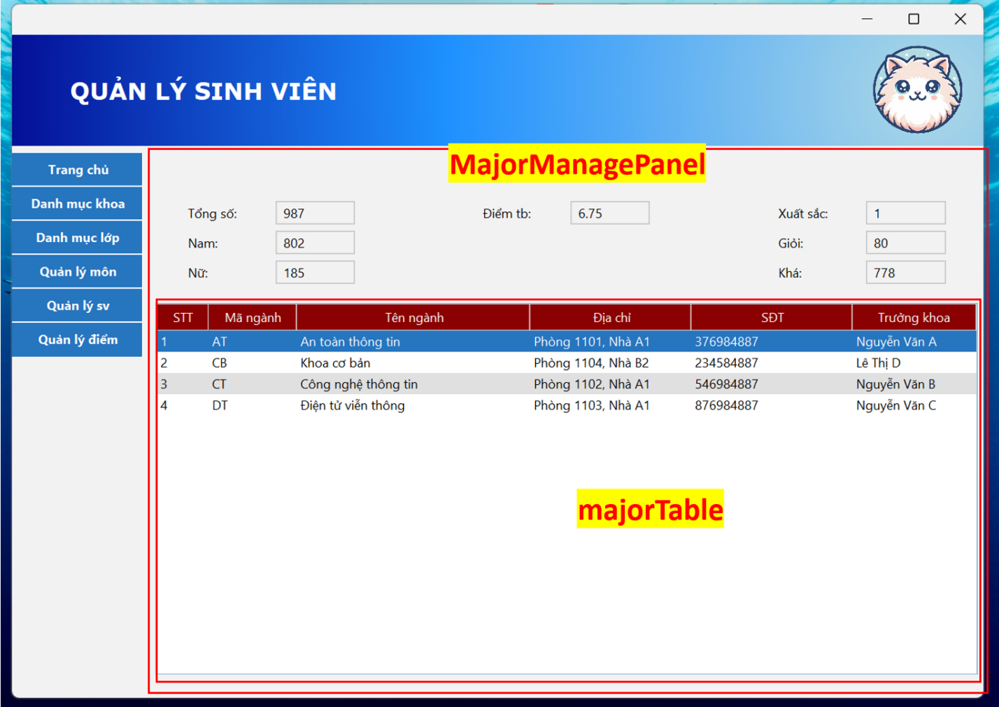

Các trường thông tin được cập nhật mỗi khi người dùng chọn khoa trên bảng.

Về cơ bản vẫn là construct request, tạo câu lệnh query, trả kết quả. Luồng hoạt động tương tự `Login`.

Ví dụ về các lấy điểm trung bình:

`MajorManagePanel`

```java
        // update average score in text field
        double averageScore = MajorManagePanelController.getAverageScoreByMajorId(majorId);
        // get first 2 digits after decimal point
        averageScore = Math.round(averageScore * 100.0) / 100.0;
        avgScoreField.setText(Double.toString(averageScore));

MajorManagePanelController
    // get average score by majorId
    public static double getAverageScoreByMajorId(String majorId) {
        return MajorDAO.getAverageScore(majorId);
    }

MajorDAO
    public static float getAverageScore(String majorId) {
        try (Connection connection = DatabaseConnection.connect()) {
            Statement statement = connection.createStatement();
            ResultSet resultSet = statement.executeQuery("SELECT AVG(scores.score) AS average_score"
                    + " FROM scores JOIN students ON scores.student_id = students.student_id JOIN classes ON students.class_id = classes.class_id"
                    + " WHERE scores.score IS NOT NULL AND classes.major_id = '" + majorId + "'");
            if (resultSet.next()) {
                return resultSet.getFloat(1);
            } else {
                return 0;
            }
        } catch (SQLException e) {
            e.printStackTrace();
            return 0;
        }
    }

```
### c. Quản lý sinh viên (studentManagePanel)

Thành phần:

```java
    private javax.swing.JButton addStudentButton;
    private javax.swing.JTextField addressInput;
    private javax.swing.JLabel addressLabel;
    private javax.swing.JTextField classIdInput;
    private javax.swing.JLabel classIdLabel;
    private javax.swing.JMenuItem deleteItem;
    private javax.swing.JMenuItem editItem;
    private javax.swing.JLabel footerLabel;
    private javax.swing.JComboBox<String> genderInput;
    private javax.swing.JLabel genderLabel;
    private javax.swing.JPopupMenu popupMenu;
    private javax.swing.JButton searchStudentButton;
    private javax.swing.JTextField studentIdInput;
    private javax.swing.JLabel studentIdlabel;
    private javax.swing.JTextField studentNameInput;
    private javax.swing.JLabel studentNameLabel;
    private javax.swing.JTable studentTable;
    private javax.swing.JScrollPane tableScrollPane;
```

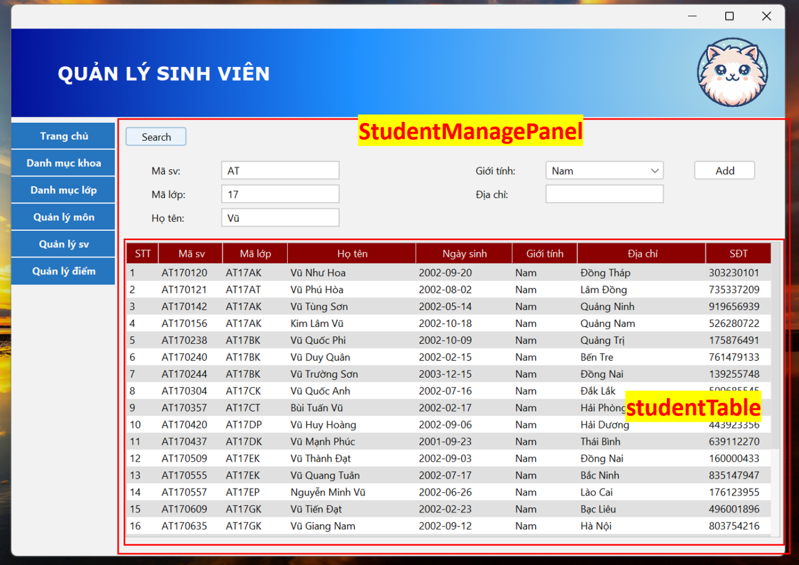

`Guest` chỉ có quyền xem, không thể thêm, sửa, xóa.
Kiểm tra quyền trước khi thực hiện hành động:
```java
        if (!UserSession.getIsAdmin()) {
            return null;
        }
```
Thông báo

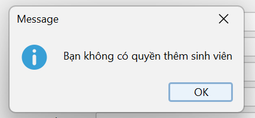

**Thêm sinh viên**

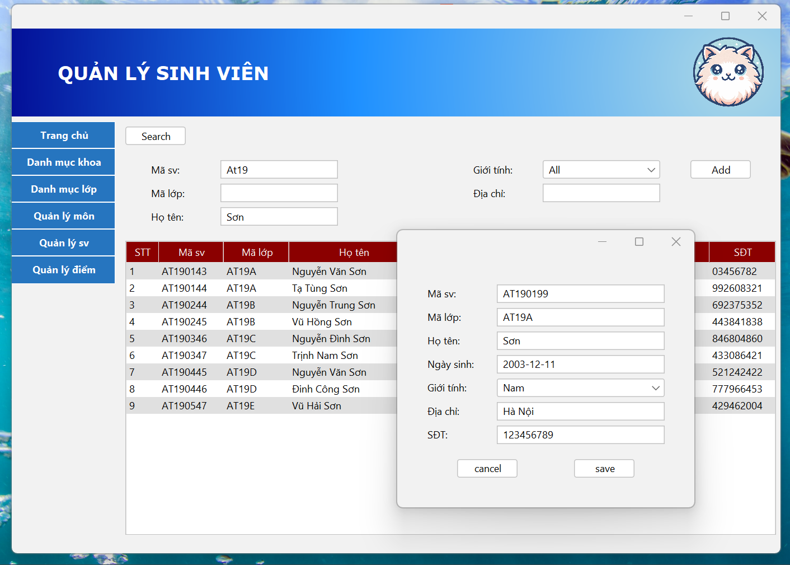

Nhấn nút `Add`, có cửa sổ bật lên, điền thông tin
`save` để lưu, `cancel` để hủy

Thông báo

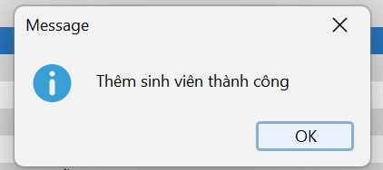

Bảng sinh viên được cập nhật ngay sau đó

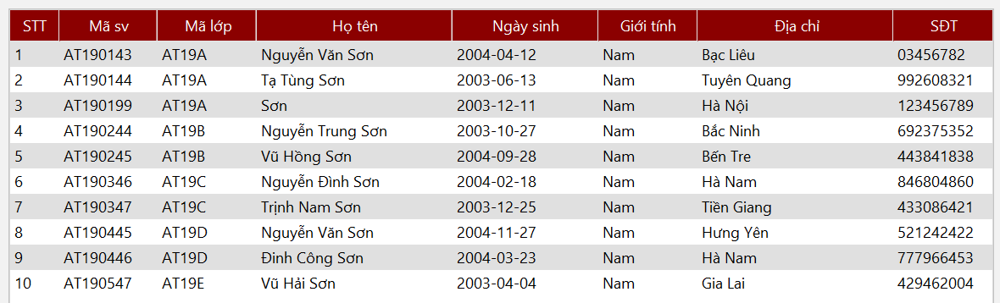

**Sửa sinh viên**

Nhấn chuột phải vào sinh viên cần sửa, chọn `edit`

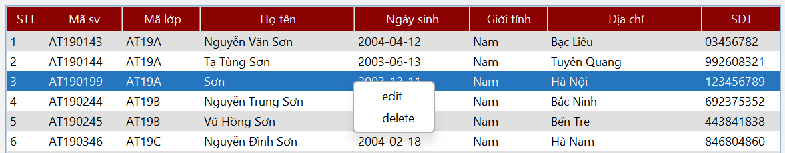

Sửa các trường cần thiết

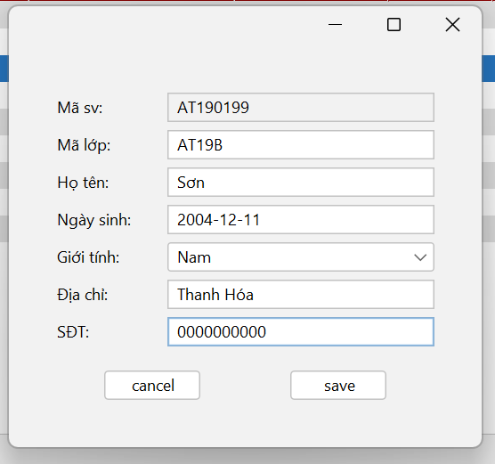

`Save` để lưu thay đổi, `cancel` để hủy

Thông báo

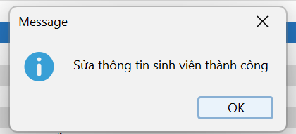

Bảng sinh viên được cập nhật ngay

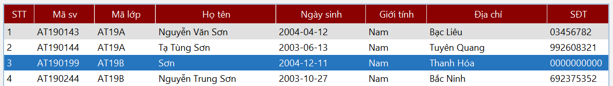

**Xóa sinh viên**

Nhấp chột phải vào sinh viên cần xóa, chọn delete. Xác nhận

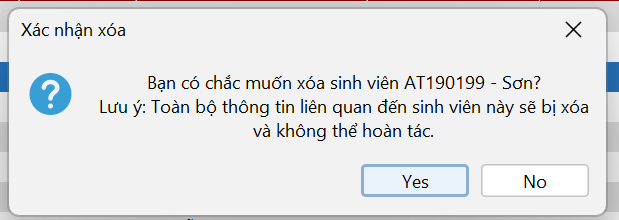

Thông báo

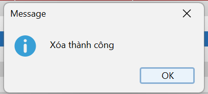

Bảng được cập nhật, không còn sinh viên đó nữa.

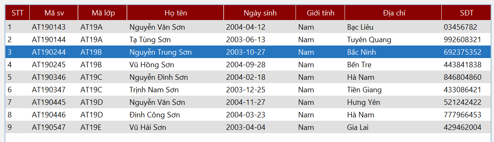

> Lưu ý: Do tham chiếu khóa ngoại giữa các bảng, không thể thêm sinh viên vào lớp. Thay vào đó, cần tạo lớp trước. Tương tự với các trường hợp khác.

### d. Quản lý điểm (scoreManagePanel)

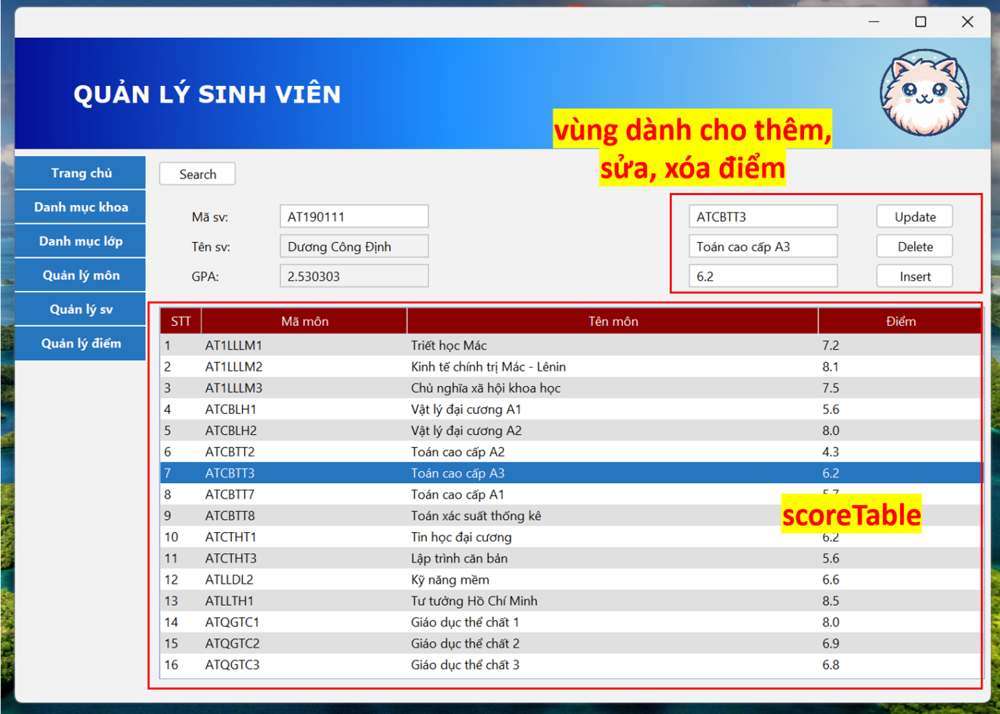

> Do đây là project học tập, nên nhóm muốn triển khai thêm các tiếp cận khác. Ở đây giao diện làm việc bố trí hơi khác so với phần sinh viên, nhưng chức năng, phần xử lý “backend” vẫn tương tự. Vậy nhóm xin phép chỉ giới thiệu giao diện.

Các trường để thêm, sửa, xóa sẽ được cập nhật theo hàng người dùng chọn.

Người dùng với quyền admin có thể sửa các trường đó, nhấn `Insert` để thêm điểm, `Update` để sửa điểm hoặc `Delete` để xóa điểm theo Mã môn và mã sinh viên.

**Update điểm**

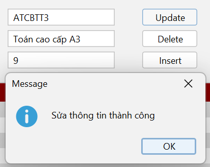

Sau đó, bảng điểm được cập nhật

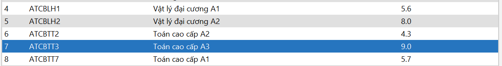

**Insert điểm**

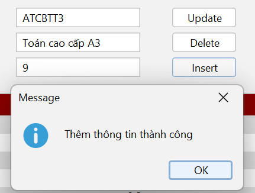

**Delete điểm**

Xác nhận delete điểm:

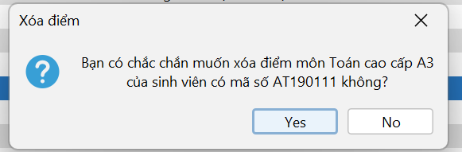

Xóa thành công

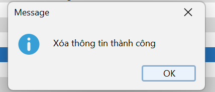

Và bảng điểm được cập nhật

### e. Quản lý môn (subjectManagePanel)

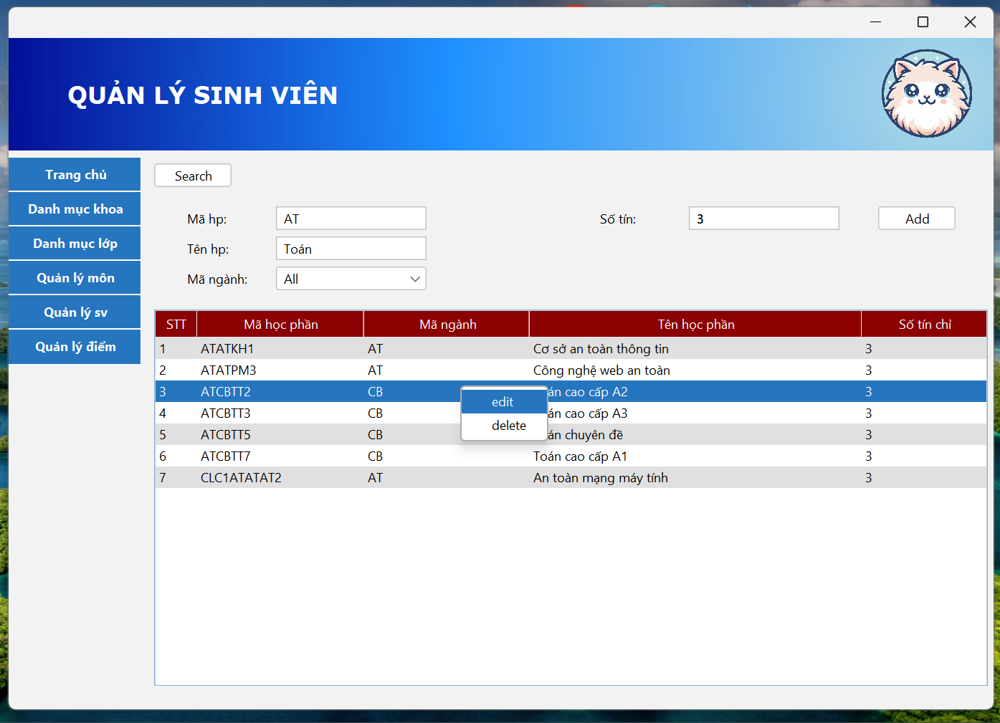

### f. Danh mục lớp (classManagePanel)

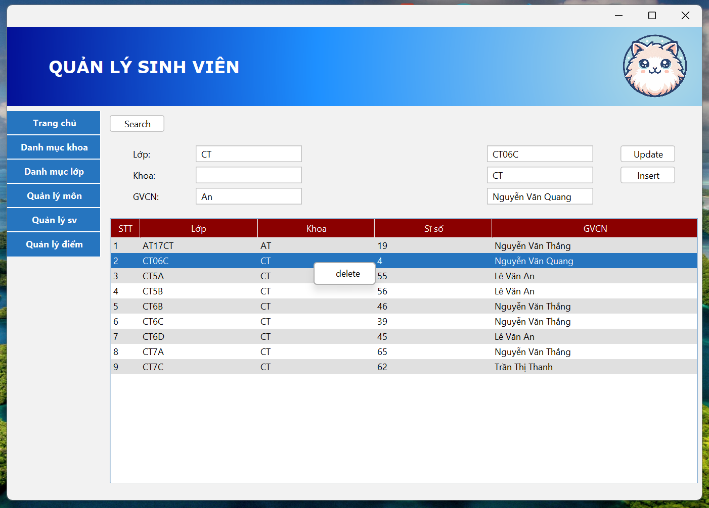

## IV. KẾT LUẬN

- Đã hoàn thành các chức năng cơ bản của ứng dụng
- Có thể mở rộng thêm các chức năng khác

## V. TÀI LIỆU THAM KHẢO

- [Maven](https://maven.apache.org/)
- [Java Swing](https://docs.oracle.com/javase/tutorial/uiswing/)
- [Java JDBC](https://docs.oracle.com/javase/tutorial/jdbc/)

